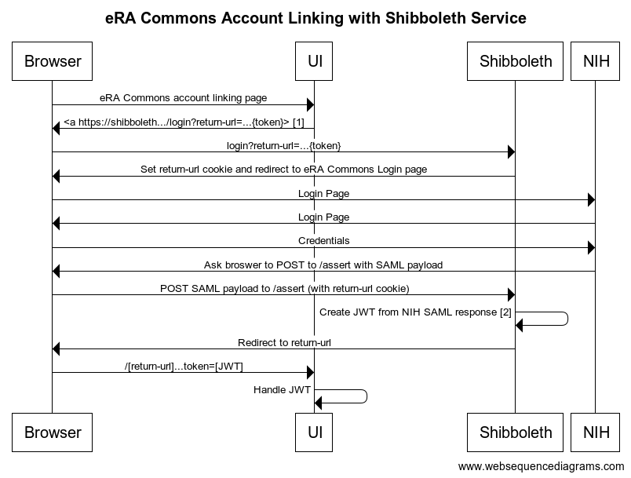

# Shibboleth Service Provider

A generic Shibboleth service provider service for use in Shibboleth authentication schemes (e.g. NIH).

https://broad-shibboleth-prod.appspot.com/



<!--
title eRA Commons Account Linking with Shibboleth Service
Browser->UI: eRA Commons account linking page
UI->Browser: <a https://shibboleth.../login?return-url=...{token}> [1]
Browser->Shibboleth: login?return-url=...{token}
Shibboleth->Browser: Set return-url cookie and redirect to eRA Commons Login page
Browser->NIH: Login Page
NIH->Browser: Login Page
Browser->NIH: Credentials
NIH->Browser: Ask broswer to POST to /assert with SAML payload
Browser->Shibboleth: POST SAML payload to /assert (with return-url cookie)
Shibboleth->Shibboleth: Create JWT from NIH SAML response [2]
Shibboleth->Browser: Redirect to return-url
Browser->UI: /[return-url]...token=[JWT]
UI->UI: Handle JWT
-->

1. The web UI presents a link with a `return-url` parameter which includes the literal string `{token}`. Once the user has successfully completed the eRA Commons login flow, they will be redirected to this URL with the `{token}` literal replaced by the encoded JWT.
2. The JWT is encoded and signed with this system's private key. It must be verified using this system's public key, available at the URL `/public-key.pem`.

## Development

### Philosophy

Fast cycles enable learning through experimentation. This provides the foundation for deep system interrogation and innovation as well as safety because of the ability to recover quickly. Fast cycles have been prioritized in this implementation, both for local changes as well as changes to the system as it exists in a production environment.

Approachability is achieved through supporting development and testing as first-class features. Fake, development-appropriate flows with examples are implemented and supported as production features.

Loose coupling is achieved through parameterization, specifically the `return-url`. This has security implications, so these URLs must be on a whitelist. The flow is carefully constructed so developers can complete and test a production implementation before requesting addition to the whitelist, which is not necessary to enable the flow, only to make it smoother.

### Getting Started

```bash
npm start
```

Minimal server up test:

```bash
curl localhost:8080/hello
```

Beyond this, it should be possible to interrogate the system by using any HTTP client. The error messages should help guide toward correct usage. This ideal is not always achieved, but it is the goal.

### Hot Reloading

If running locally, the server must be started with the environment variable `GOOGLE_CLOUD_PROJECT` defined, which provides the source for permissions checking.

```bash
GOOGLE_CLOUD_PROJECT=broad-shibboleth-prod npm start
```

```bash
tar -c --exclude='./node_modules/*' . \
  | curl localhost:8080/.src --data-binary @- \
  -H "Authorization: Bearer $(gcloud auth print-access-token)"
```
